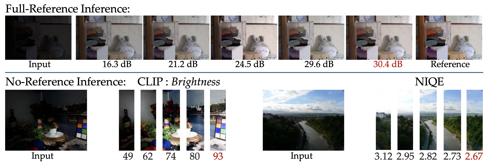
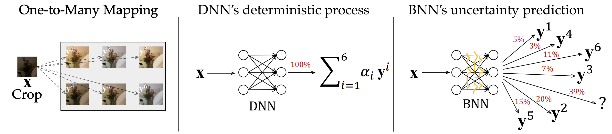
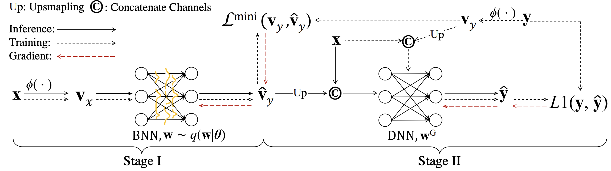
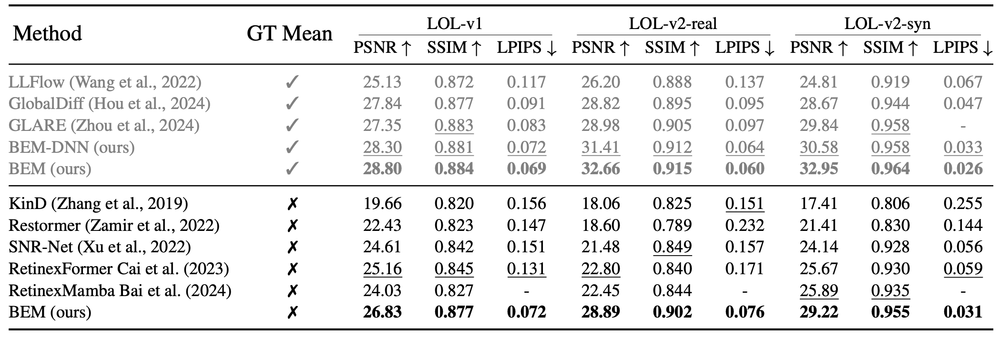
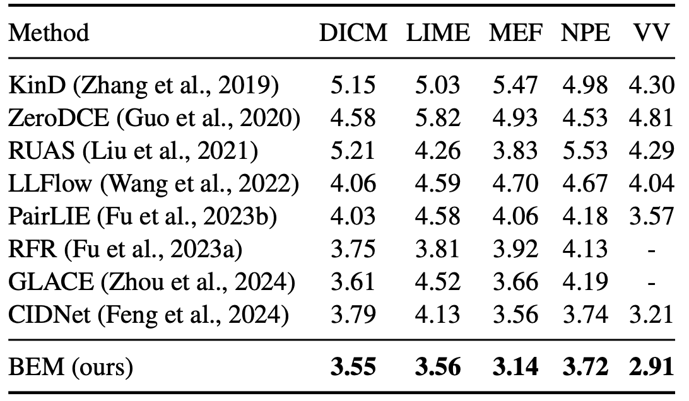
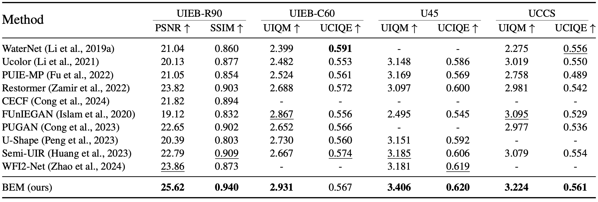
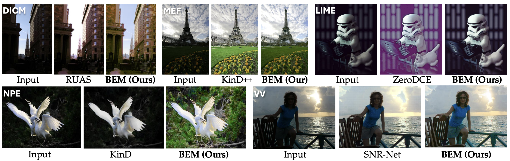

# Bayesian Enhancement Model

This is the official code for the paper [Bayesian Enhancement Models for One-to-Many Mapping in Image Enhancement](https://openreview.net/pdf?id=jJJOoLVAEm)


<p align="center">  </p> 
&nbsp;      
  
[](https://paperswithcode.com/sota/low-light-image-enhancement-on-lol?p=bayesian-enhancement-models-for-one-to-many)
[](https://paperswithcode.com/sota/low-light-image-enhancement-on-dicm?p=bayesian-enhancement-models-for-one-to-many)	
[](https://paperswithcode.com/sota/low-light-image-enhancement-on-lime?p=bayesian-enhancement-models-for-one-to-many)
[](https://paperswithcode.com/sota/low-light-image-enhancement-on-mef?p=bayesian-enhancement-models-for-one-to-many)
[](https://paperswithcode.com/sota/low-light-image-enhancement-on-npe?p=bayesian-enhancement-models-for-one-to-many)
[](https://paperswithcode.com/sota/low-light-image-enhancement-on-vv?p=bayesian-enhancement-models-for-one-to-many)


## News 💡
- **2024.10.31** Masked Image Modeling (MIM) is implemented to enhance our Stage-II network. We haven’t evaluated its effectiveness, and our team has no future plan to inlcude MIM into the current paper or draw new papers for it. We welcome anyone interested in continuing this research and invite discussions.
- **2024.10.31** The model checkpoints trained on LOLv1 is released.  
- **2024.10.21** Code has been released. We train each model multiple times and report the median of the test results. Therefore, the results you obtain may be higher than those reported in the paper. If you encounter any difficulties in reproducing our work, please issue them. We look forward to seeing future developments based on the Bayesian Enhancement Model ✨


## HD Visulisation
<p align="center">  </p>

##  Proposed Bayesian Enhancement Model

### Deterministic NN vs Bayesian NN:
<p align="center">  </p>

### Two-Stage Pipeline:
<p align="center">  </p>


## Results
<details close>
<summary><b>Performance on LOL-v1, LOL-v2-real and LOL-v2-syn:</b></summary>


</details>

<details close>
<summary><b>Performance on LIME, NPE, MEF, DICM and VV:</b></summary>


</details>

<details close>
<summary><b>Performance on UIEB, C60, U50 and UCCS:</b></summary>


</details>


<details close>
<summary><b>Visulisation on LIME, NPE, MEF, DICM and VV:</b></summary>


</details>

<details close>
<summary><b>Visulisation on UIEB, U45 and C60:</b></summary>


</details>


## Dependencies and Installation

- Python 3.10.12
- Pytorch 1.13.1

#### Create Conda Environment

```bash
conda create --n BEM python=3.10.12
conda activate BEM
```

#### Clone Repo

```bash
git clone git@github.com:Anonymous1563/Bayesian-Enhancement-Model.git
```

#### Install Dependencies

```bash
cd BEM
pip install -r requirements.txt

```

#### Install BasicSR

```bash
python setup.py develop --no_cuda_ext
```

#### Install 2D Selective Scan
```bash
cd kernels/selective_scan && pip install .
```


&nbsp;

## Prepare Dataset
Download the LOLv1 and LOLv2 datasets from [here](https://daooshee.github.io/BMVC2018website/).

Download the LIME, NPE, MEF, DICM, and VV datasets from [here](https://daooshee.github.io/BMVC2018website/).

Download UIEB datasets from [here](https://li-chongyi.github.io/proj_benchmark.html).
&nbsp;


## Pre-trained Models
Coming Soon ...

## Full-Reference Evaluation

#### Low-Light Image Enhancement
```shell
# LOL-v1
python3 Enhancement/eval.py --opt experiments/CG_UNet_LOLv1/CG_UNet_LOLv1.yml --weights experiments/CG_UNet_LOLv1/ckpt.pth \
--cond_opt /experiments/IE_UNet_LOLv1/IE_UNet_LOLv1.yml --cond_weights experiments/IE_UNet_LOLv1/ckpt.pth \
--lpips --dataset LOLv1

# LOL-v2-real
python3 Enhancement/eval.py --opt experiments/CG_UNet_LOLv2Real/CG_UNet_LOLv2Real.yml --weights experiments/CG_UNet_LOLv2Real/ckpt.pth \
--cond_opt /experiments/IE_UNet_LOLv2Real/IE_UNet_LOLv2Real.yml --cond_weights experiments/IE_UNet_LOLv2Real/ckpt.pth \
--lpips --dataset LOLv2Real

# LOL-v2-syn
python3 Enhancement/eval.py --opt experiments/CG_UNet_LOLv2Syn/CG_UNet_LOLv2Syn.yml --weights experiments/CG_UNet_LOLv2Syn/ckpt.pth \
--cond_opt /experiments/IE_UNet_LOLv2Syn/IE_UNet_LOLv2Syn.yml --cond_weights experiments/IE_UNet_LOLv2Syn/ckpt.pth \
--lpips --dataset LOLv2Syn
```

- Evaluate using Groundtruth Mean
```shell
# LOL-v1
python3 Enhancement/eval.py --opt experiments/CG_UNet_LOLv1/CG_UNet_LOLv1.yml --weights experiments/CG_UNet_LOLv1/ckpt.pth \
--cond_opt /experiments/IE_UNet_LOLv1/IE_UNet_LOLv1.yml --cond_weights experiments/IE_UNet_LOLv1/ckpt.pth \
--lpips --dataset LOLv1 --GT_mean
```

- BEM's Deterministic Mode (BEM-DNN)
```shell
# LOL-v1
python3 Enhancement/eval.py --opt experiments/CG_UNet_LOLv1/CG_UNet_LOLv1.yml --weights experiments/CG_UNet_LOLv1/ckpt.pth \
--cond_opt /experiments/IE_UNet_LOLv1/IE_UNet_LOLv1.yml --cond_weights experiments/IE_UNet_LOLv1/ckpt.pth \
--lpips --dataset LOLv1 --GT_mean --deterministic
```

#### Underwater Image Enhancement
```shell
# UIEB
python3 Enhancement/eval.py --opt experiments/CG_UNet_UIEB/CG_UNet_UIEB.yml --weights experiments/CG_UNet_UIEB/ckpt.pth \
--cond_opt /experiments/IE_UNet_UIEB/IE_UNet_UIEB.yml --cond_weights experiments/IE_UNet_UIEB/ckpt.pth \
--lpips -dataset UIEB
```

## No-Reference Evaluation

#### Low-Light Image Enhancement
```shell
# DICM with NIQE
python3 Enhancement/eval.py --opt experiments/CG_UNet_LOLv2Syn/CG_UNet_LOLv2Syn.yml --weights experiments/CG_UNet_LOLv2Syn/ckpt.pth \
--cond_opt /experiments/IE_UNet_LOLv2Syn/IE_UNet_LOLv2Syn.yml --cond_weights experiments/IE_UNet_LOLv2Syn/ckpt.pth \
--dataset DICM --input_dir datasets/DICM --no_ref  niqe

# VV with CLIP-IQA
python3 Enhancement/eval.py --opt experiments/CG_UNet_LOLv2Syn/CG_UNet_LOLv2Syn.yml --weights experiments/CG_UNet_LOLv2Syn/ckpt.pth \
--cond_opt /experiments/IE_UNet_LOLv2Syn/IE_UNet_LOLv2Syn.yml --cond_weights experiments/IE_UNet_LOLv2Syn/ckpt.pth \
--dataset DICM --input_dir datasets/VV --no_ref  clip
```


#### Underwater Image Enhancement
```shell

# C60 with UIQM
python3 Enhancement/eval.py --opt experiments/CG_UNet_UIEB/CG_UNet_UIEB.yml --weights experiments/CG_UNet_UIEB/ckpt.pth \
--cond_opt /experiments/IE_UNet_UIEB/IE_UNet_UIEB.yml --cond_weights experiments/IE_UNet_UIEB/ckpt.pth \
--dataset DICM --input_dir datasets/C60 --no_ref uiqm_uciqe --uiqm_weight 1.0

# C60 with UCIQE
python3 Enhancement/eval.py --opt experiments/CG_UNet_UIEB/CG_UNet_UIEB.yml --weights experiments/CG_UNet_UIEB/ckpt.pth \
--cond_opt /experiments/IE_UNet_UIEB/IE_UNet_UIEB.yml --cond_weights experiments/IE_UNet_UIEB/ckpt.pth \
--dataset DICM --input_dir datasets/C60 --no_ref uiqm_uciqe --uiqm_weight 0.0

# U45 with UIQM
python3 Enhancement/eval.py --opt experiments/CG_UNet_UIEB/CG_UNet_UIEB.yml --weights experiments/CG_UNet_UIEB/ckpt.pth \
--cond_opt /experiments/IE_UNet_UIEB/IE_UNet_UIEB.yml --cond_weights experiments/IE_UNet_UIEB/ckpt.pth \
--dataset DICM --input_dir datasets/U45 --no_ref uiqm_uciqe --uiqm_weight 1.0

# U45 with UCIQE
python3 Enhancement/eval.py --opt experiments/CG_UNet_UIEB/CG_UNet_UIEB.yml --weights experiments/CG_UNet_UIEB/ckpt.pth \
--cond_opt /experiments/IE_UNet_UIEB/IE_UNet_UIEB.yml --cond_weights experiments/IE_UNet_UIEB/ckpt.pth \
--dataset DICM --input_dir datasets/U45 --no_ref uiqm_uciqe --uiqm_weight 0.0

# UCCS with UIQM
python3 Enhancement/eval.py --opt experiments/CG_UNet_UIEB/CG_UNet_UIEB.yml --weights experiments/CG_UNet_UIEB/ckpt.pth \
--cond_opt /experiments/IE_UNet_UIEB/IE_UNet_UIEB.yml --cond_weights experiments/IE_UNet_UIEB/ckpt.pth \
--dataset DICM --input_dir datasets/U45 --no_ref uiqm_uciqe --uiqm_weight 1.0

# UCCS with UCIQE
python3 Enhancement/eval.py --opt experiments/CG_UNet_UIEB/CG_UNet_UIEB.yml --weights experiments/CG_UNet_UIEB/ckpt.pth \
--cond_opt /experiments/IE_UNet_UIEB/IE_UNet_UIEB.yml --cond_weights experiments/IE_UNet_UIEB/ckpt.pth \
--dataset DICM --input_dir datasets/UCCS --no_ref uiqm_uciqe --uiqm_weight 0.0
```

## Training

```shell

# Stage-I on LOL-v1
python3 basicsr/train.py --opt Options/CG_UNet_LOLv1.yml
# Stage-II on LOL-v1
python3 basicsr/train.py --opt Options/IE_UNet_LOLv1.yml


# Stage-I on LOL-v2-real
python3 basicsr/train.py --opt Options/CG_UNet_LOLv2Real.yml
# Stage-II on LOL-v2-real
python3 basicsr/train.py --opt Options/IE_UNet_LOLv2Real.yml


# Stage-I on LOL-v2-syn
python3 basicsr/train.py --opt Options/CG_UNet_LOLv2Syn.yml
# Stage-II on LOL-v2-syn
python3 basicsr/train.py --opt Options/IE_UNet_LOLv2Syn.yml


# Stage-I on UIEB
python3 basicsr/train.py --opt Options/CG_UNet_UIEB.yml
# Stage-II on UIEB
python3 basicsr/train.py --opt Options/IE_UNet_UIEB.yml

```
&nbsp;


## Citation

```shell
@inproceedings{anonymous2024bayesian,
    title={Bayesian Enhancement Models for One-to-Many Mapping in Image Enhancement},
    author={Anonymous},
    booktitle={Submitted to The Thirteenth International Conference on Learning Representations},
    year={2024},
    url={https://openreview.net/forum?id=jJJOoLVAEm},
    note={under review}
    }
```


